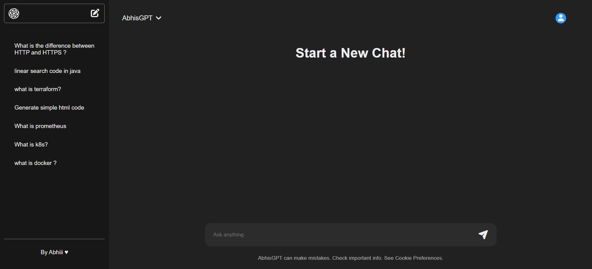
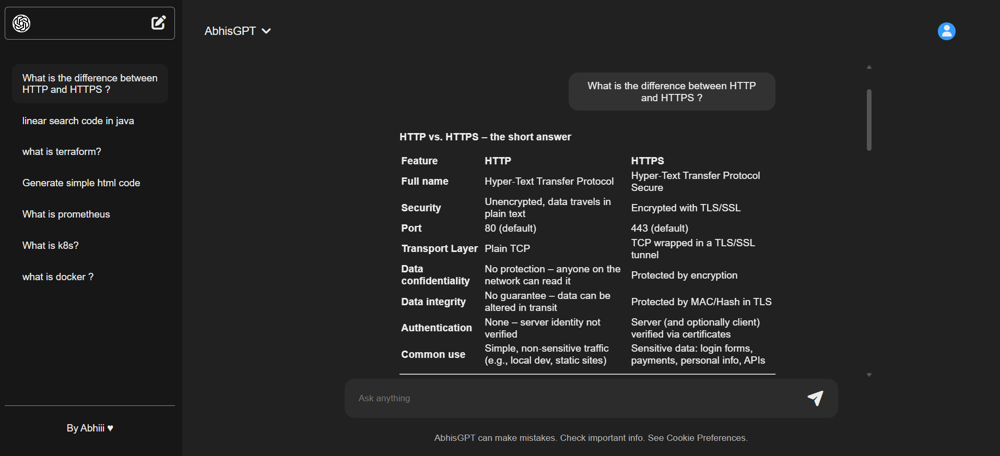
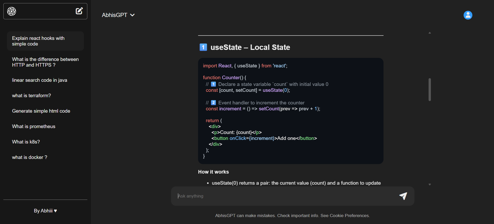
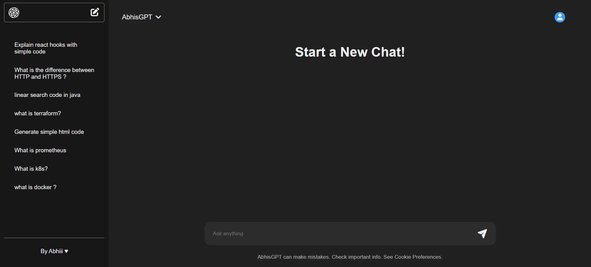

# 🤖 ABHIsGPT

### AI-Powered Chat Application — A ChatGPT-like Full Stack Application

**React.js · Node.js · Express.js · MongoDB · OpenAI API · REST API**


---

## 📌 About The Project

**ABHIsGPT** is a full-stack AI chat application inspired by ChatGPT.

The application allows users to interact with an AI assistant through a responsive chat interface. Users can create new conversations, access previous chats from the sidebar, and receive AI-generated responses.

The project was built to understand how a modern AI-powered application works from **frontend to backend and API integration**.

---

## 📸 Screenshots

### 🏠 New Chat



### 💬 AI Chat Conversation





### 📚 Chat History




---

## ✨ Features

* 🤖 AI-powered conversations
* 💬 ChatGPT-like chat interface
* 🆕 Create new conversations
* 📚 Store and access previous conversations
* 🗂️ Sidebar chat history
* 🔄 Automatic chat scrolling
* ⏳ Loading state while generating responses
* 🔐 User authentication
* 🛡️ Protected routes
* 🌙 Dark-themed responsive UI
* ⚡ REST API integration
* 🗄️ MongoDB database integration
* 📱 Responsive design

---

## 🛠️ Tech Stack

### Frontend

* React.js
* JavaScript
* CSS
* Vite

### Backend

* Node.js
* Express.js
* REST APIs

### Database

* MongoDB

### AI Integration

* OpenAI API

### Tools

* Git
* GitHub
* VS Code

---

## 🏗️ Project Architecture

```text
ABHIsGPT
│
├── Backend
│   ├── models
│   ├── routes
│   ├── utils
│   ├── server.js
│   ├── package.json
│   └── .env
│
├── Frontend
│   ├── public
│   ├── src
│   │   ├── assets
│   │   ├── App.jsx
│   │   ├── Chat.jsx
│   │   ├── ChatWindow.jsx
│   │   ├── Sidebar.jsx
│   │   ├── MyContext.jsx
│   │   └── main.jsx
│   ├── package.json
│   └── vite.config.js
│
└── README.md
```

---

## 🔄 How It Works

```text
User
  │
  ▼
React Frontend
  │
  ▼
Express.js Backend
  │
  ├──────────────► MongoDB
  │
  ▼
OpenAI API
  │
  ▼
AI Generated Response
  │
  ▼
React Chat Interface
```

1. User enters a question in the chat interface.
2. React sends the request to the backend.
3. Express.js receives and processes the request.
4. The backend communicates with the OpenAI API.
5. The AI-generated response is returned to the frontend.
6. The conversation can be stored and accessed from chat history.

---

## 🚀 Getting Started

### 1. Clone the Repository

```bash
git clone https://github.com/AbhishekThite387/ABHIsGPT.git
cd ABHIsGPT
```

### 2. Install Backend Dependencies

```bash
cd Backend
npm install
```

### 3. Install Frontend Dependencies

```bash
cd ../Frontend
npm install
```

### 4. Configure Environment Variables

Create a `.env` file inside the `Backend` folder.

```env
OPENAI_API_KEY=your_openai_api_key
MONGODB_URI=your_mongodb_connection_string
```

### 5. Start Backend

```bash
cd Backend
npm start
```

### 6. Start Frontend

Open another terminal:

```bash
cd Frontend
npm run dev
```

Then open the local development URL shown by Vite.

---

## 📂 Screenshots Folder

Create a folder in your project:

```text
ABHIsGPT/
│
├── Backend/
├── Frontend/
├── screenshots/
│   ├── home.png
│   ├── chat.png
│   ├── history.png
│   └── responsive.png
│
└── README.md
```

Then take screenshots of your actual application and place them inside the `screenshots` folder.

---

## 🔮 Future Improvements

* Voice-based conversations
* Markdown response rendering
* Code syntax highlighting
* File upload support
* Multiple AI models
* Message editing
* Conversation search
* Deployment using Docker
* CI/CD pipeline
* Cloud deployment

---

## 👨‍💻 Author

**Abhishek Thite**

* GitHub: [AbhishekThite387](https://github.com/AbhishekThite387)
* LinkedIn: [Abhishek Thite](https://www.linkedin.com/)

---

## ⭐ Support

If you found this project useful, consider giving it a ⭐ on GitHub.
